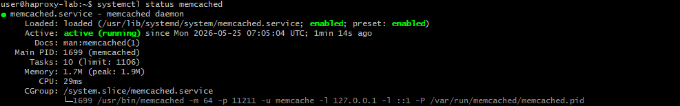
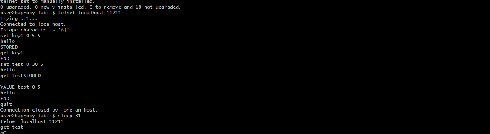
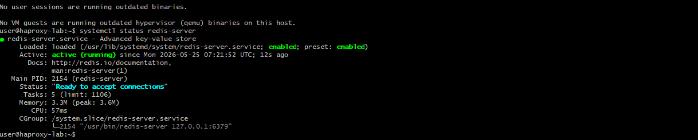
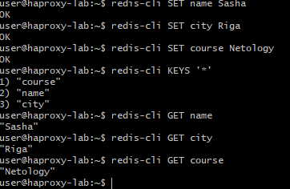

## Домашнее задание «Кеширование Redis/memcached»

Александр Масайлов

---

## Задание 1

Кеширование помогает ускорить работу сайтов и приложений, уменьшить нагрузку на сервер и базу данных.

---

## Задание 2

Установил и запустил memcached.

Проверка:

```bash
systemctl status memcached
```

Скриншот:



---

## Задание 3

Создал ключи с TTL и проверил их удаление через время.

Скриншот:



---

## Задание 4

Установил Redis и создал несколько ключей.

Команды:

```bash
redis-cli SET name Sasha
redis-cli SET city Riga
redis-cli SET course Netology
```

Проверка:

```bash
redis-cli KEYS '*'
redis-cli GET name
redis-cli GET city
redis-cli GET course
```

Скриншоты:




 redis-hw
